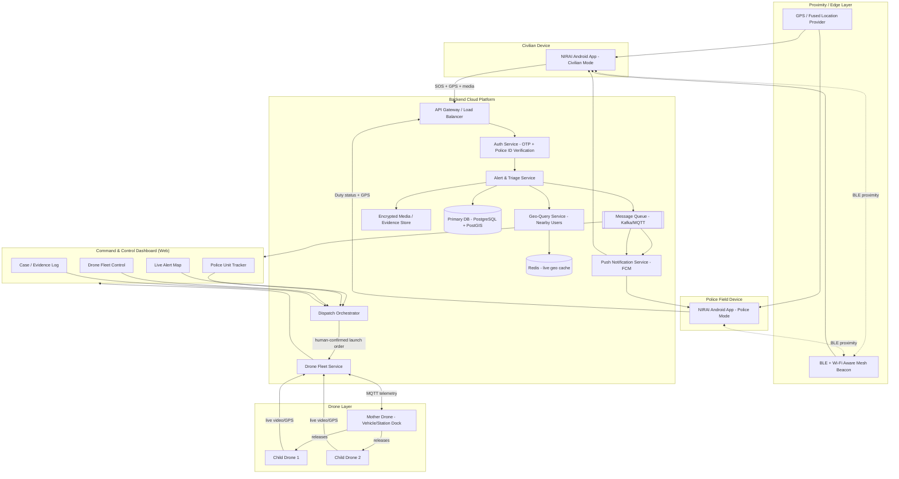
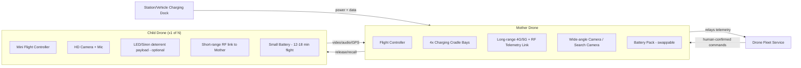
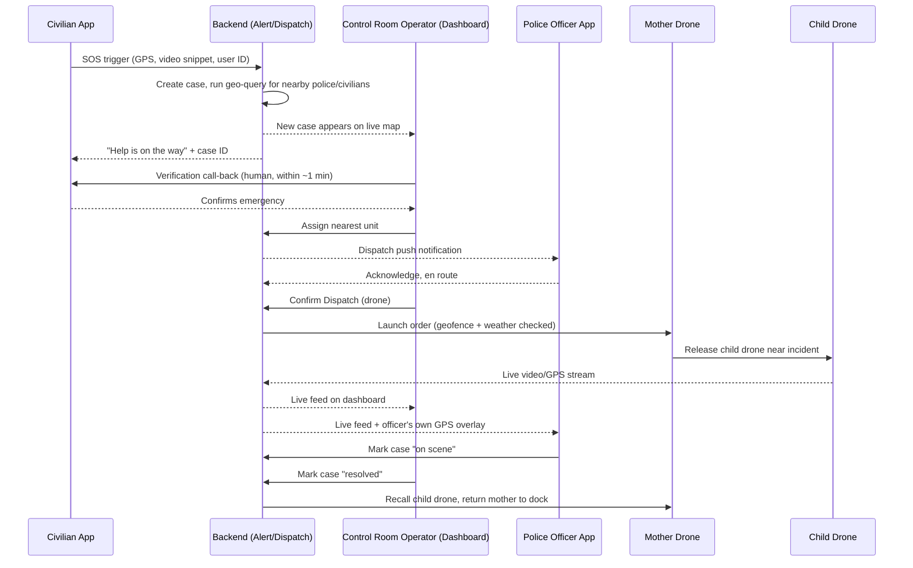
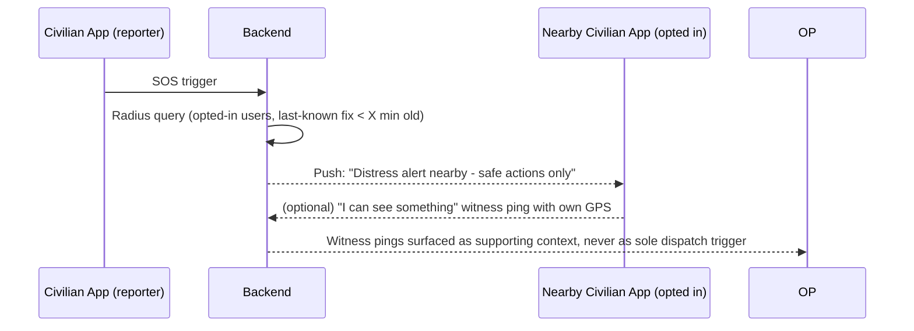

# NIRAI — Networked Intelligent Rapid-response & AI-driven Infrastructure
### Single Source-of-Truth: Architecture, Product Plan & Development Blueprint
**Version 1.0 | Prepared for: MSME Idea Hackathon 6.0 (Idea No. 26INC06TN000994) — Team NIRAI**
**Domain: Robotics & Automation — Public Safety / Women & Citizen Safety**

> This document is the single reference used to design, build, and pitch NIRAI. It covers the problem, the architecture, every module, data flow, tech stack, security, drone legality in India, gaps in the original idea with fixes, and the phased build plan. Keep this file versioned in the repo root as `ARCHITECTURE.md`.

---

## Table of Contents
1. [Executive Summary](#1-executive-summary)
2. [Problem Statement](#2-problem-statement)
3. [Landscape: Where NIRAI Sits vs. Existing Tamil Nadu Systems](#3-landscape-where-nirai-sits-vs-existing-tamil-nadu-systems)
4. [Core Concept & User Roles](#4-core-concept--user-roles)
5. [Critical Review — Major Problems in the Original Idea & How the Architecture Fixes Them](#5-critical-review--major-problems-in-the-original-idea--how-the-architecture-fixes-them)
6. [High-Level System Architecture](#6-high-level-system-architecture)
7. [Module 1 — NIRAI Android App](#7-module-1--nirai-android-app)
8. [Module 2 — Command & Control Dashboard](#8-module-2--command--control-dashboard)
9. [Module 3 — Backend / Cloud Platform](#9-module-3--backend--cloud-platform)
10. [Module 4 — Drone System (Mother–Child Architecture)](#10-module-4--drone-system-motherchild-architecture)
11. [Module 5 — Police Tracking & Dispatch Engine](#11-module-5--police-tracking--dispatch-engine)
12. [End-to-End Data Flow (Sequence Diagrams)](#12-end-to-end-data-flow-sequence-diagrams)
13. [Database Schema](#13-database-schema)
14. [API & Connectivity Design](#14-api--connectivity-design)
15. [Proximity / "Nearby User" Detection Architecture](#15-proximity--nearby-user-detection-architecture)
16. [Technology Stack](#16-technology-stack)
17. [Security, Privacy & Legal Compliance](#17-security-privacy--legal-compliance)
18. [Drone Regulatory Framework (India, 2026)](#18-drone-regulatory-framework-india-2026)
19. [Hardware Bill of Materials (Drone + Dock)](#19-hardware-bill-of-materials-drone--dock)
20. [Reliability, Offline Mode & Failure Handling](#20-reliability-offline-mode--failure-handling)
21. [Development Roadmap (Phased Plan)](#21-development-roadmap-phased-plan)
22. [Team & Module Ownership](#22-team--module-ownership)
23. [Risks & Mitigations](#23-risks--mitigations)
24. [Glossary](#24-glossary)

---

## 1. Executive Summary

**NIRAI** is a three-part public-safety system:

1. **Android App** — worn/carried by both **civilians** and **verified police personnel**. It detects nearby app users via a proximity layer, distinguishes role (police vs civilian), and lets any user raise a distress alert that is instantly geo-tagged and broadcast.
2. **Command & Control Dashboard** — the nerve center used by police control-room operators. It visualizes live alerts, nearby police units, drone fleet status, and lets a human operator authorize dispatch of a **mother drone**, which in turn releases **child drones** to the incident location.
3. **Drone Fleet (Mother–Child)** — a vehicle-mounted or station-mounted "mother" drone carries and charges 2–4 small "child" drones. On human-authorized dispatch, the mother drone travels toward the incident and releases child drones for close-range visual confirmation, live streaming, and (optionally) a deterrent siren/light payload.

The differentiator versus Tamil Nadu's existing **Kavalan – SOS** and **Kaaval Uthavi** apps (both built around a call-center-verified SOS button) is that NIRAI adds:
- **Peer-to-peer proximity awareness** (nearest civilians/police notified directly, not only the control room),
- **Aerial first-response** (drone reaches the scene before a patrol vehicle in dense or congested areas),
- **A unified dashboard** that fuses alert data, police unit GPS, and drone telemetry into one operational picture.

NIRAI is designed to **integrate with**, not replace, the state's existing Emergency Response Support System (ERSS)/Kavalan infrastructure — see Section 3.

---

## 2. Problem Statement

- Distress incidents (harassment, stalking, assault, medical emergencies, accidents) often occur in places where **the nearest help is a bystander, not a patrol car** — but bystanders have no way to know someone nearby needs help.
- Existing SOS apps route every alert through a **centralized call center**, which is safe (human-verified, reduces false alarms) but adds a **verification and dispatch delay** — Kavalan's own documented flow involves an SOS press, a 5-second countdown, transmission to the control room, and a call-back "within a minute," followed by conventional vehicle dispatch. That is fast for a call-based system but still slower than physically nearby assistance could be.
- Response is bounded by **road access and traffic** — a police vehicle cannot always reach dense streets, campuses, or terrain quickly; **no live eyes-on-scene** exist until an officer physically arrives.
- Field officers' **live location and ETA** are not exposed to a control room in a structured, queryable way in most public-facing safety apps — command centers cannot easily answer "who is closest, and how long will they take?"
- Drones are increasingly used by Indian police for crowd control and disaster response, but there is **no standard, always-ready, dispatch-on-alert drone layer** tied directly to a personal-safety app.

**NIRAI's goal:** shrink the gap between "alert raised" and "first eyes/first responder on scene" using (a) nearby human responders, (b) a control-room dashboard with live tracking, and (c) an aerial unit that can be airborne before a vehicle arrives — while keeping a **human officer in the authorization loop** for every drone launch, for both legal and safety reasons.

---

## 3. Landscape: Where NIRAI Sits vs. Existing Tamil Nadu Systems

| Capability | **Kavalan – SOS** | **Kaaval Uthavi** | **NIRAI (proposed)** |
|---|---|---|---|
| Launch entity | TN Police / Amtex Systems | TN Police (CM-inaugurated 2022) | New system, designed to **integrate** with ERSS/SPMCR |
| Core trigger | SOS button, 5-sec countdown | "Emergency" button | SOS button **+ automatic proximity broadcast** |
| Verification | Human call-back from control room within ~1 min | Auto call-back + follow-up until closure | Human call-back **retained**, plus AI-assisted triage (video/audio cues) to prioritize the queue |
| Location routing | Sent to State Police Master Control Room (SPMCR), nearest station auto-mapped | Auto-maps nearest station | Same, **plus** nearest verified civilian/police app users notified directly |
| Media capture | Rear-camera video sent with SOS | Photo/video with complaints | Live video/audio stream, encrypted, chain-of-custody logged |
| Field responder view | Not public-facing | Not public-facing | **Command dashboard**: live officer GPS, ETA, unit status |
| Aerial response | None | None | **Mother–child drone dispatch**, human-authorized |
| Other services | Helplines, offline mode | Police verification, e-challan, complaints, alerts | Not a replacement for these — NIRAI should **plug into** SPMCR as a supplementary "first-eyes" layer, not duplicate FIR/e-challan/verification services |

**Recommended positioning:** Do **not** pitch NIRAI as a Kavalan competitor. Existing government apps already own citizen trust, the helpline number (100/112), and legal integration with FIR systems. NIRAI's realistic and fundable path is as a **B2G (business-to-government) add-on module**: a drone-and-proximity layer that Tamil Nadu Police can bolt onto SPMCR/Kavalan's backend via API, rather than asking citizens to install a second, competing app. This also solves the classic hackathon pitfall of "yet another safety app nobody downloads" — NIRAI's civilian app can even be reduced to **an SDK embedded inside Kavalan/Kaaval Uthavi** in a later phase, so citizens don't need a new install at all.

---

## 4. Core Concept & User Roles

### 4.1 Roles
| Role | Verification | Capabilities |
|---|---|---|
| **Civilian** | Phone number OTP + optional Aadhaar-linked KYC for trusted-responder tier | Raise SOS, receive nearby-alert notifications, view drone/police ETA for their own active alert only |
| **Verified Police (Field Officer)** | Government ID + department-issued credential, activated by station admin | Everything a civilian can do, plus: appears on dashboard as a "unit," receives dispatch orders, can mark alerts resolved, can request drone support manually |
| **Control Room Operator (Dashboard user)** | Department login, role-based access control (RBAC) | Views all alerts, authorizes/denies drone launch, assigns units, monitors drone telemetry, closes cases |
| **System (Automated layer)** | N/A | Never authorizes a drone launch autonomously — always requires a human's tap of "Confirm Dispatch" (see Section 5, Problem 2) |

### 4.2 What "Nearby" Means Technically
"Nearby" is **not** a background always-on tracker of every citizen (that would be a serious privacy and legal problem — see Section 5). It is a **geofenced, event-triggered radius query**:
- On SOS trigger, the backend queries which opted-in app users (civilian or police) have reported a location fix inside a **300 m–1 km radius** within the last few minutes.
- Police units are the exception: their location is tracked continuously **while on duty**, because that is standard operational telemetry for a dispatched workforce, not incidental surveillance of the public.

---

## 5. Critical Review — Major Problems in the Original Idea & How the Architecture Fixes Them

This section is deliberately blunt — these are the gaps a judge, investor, or the Tamil Nadu Police IT cell will raise immediately.

| # | Problem in the original one-line pitch | Why it's a real problem | Architectural fix |
|---|---|---|---|
| 1 | "Track nearby users" sounds like continuous surveillance | Continuous location tracking of civilians without a specific trigger is a **privacy/consent violation** (DPDP Act 2023 concerns) and would face public/regulatory pushback | Location is only sampled from opted-in users on an **event trigger** (SOS raised, or periodic low-frequency "I'm safe" heartbeat if user explicitly enables a "walk-me-home" mode). No always-on tracking by default. |
| 2 | "The drone arrives at the location" implies full autonomy | Under Indian Drone Rules 2021 (and the pending Civil Drone Bill 2025), **BVLOS (beyond visual line of sight) and autonomous dispatch require special DGCA authorization**, currently limited to a small set of approved corridors/operators (e.g., medical-delivery pilots in Telangana, Uttarakhand, Gujarat) | Every launch requires a **human dispatcher confirmation** ("Confirm Dispatch" button on the dashboard). Initial deployment is **VLOS-first**: drones operate from police-station-adjacent docking points within visual/RF range, expanding to BVLOS only after DGCA corridor approval. |
| 3 | Single "police vs civilian" flag is easy to spoof | If role is just a toggle in the app, anyone can mark themselves "police" and receive privileged alerts or send false dispatch requests | Police role is **only granted server-side** after a station admin verifies a service ID; the app cannot self-declare the role. Police accounts are periodically re-verified. |
| 4 | No plan for false alarms | A high false-alarm rate burns out both police trust and drone battery life; this killed adoption of several past "panic button" pilots | Reuse Kavalan's proven pattern: **human call-back verification** before full dispatch, plus a lightweight on-device check (are you sure? 5-second cancel window) and a repeat-false-alarm account flag. |
| 5 | No offline/low-network fallback | Rural Tamil Nadu and indoor/basement locations frequently have poor connectivity; a safety app that only works on strong 4G is unsafe by design | SOS payload falls back to **SMS/USSD** with GPS coordinates if data connectivity fails (same principle Kavalan and Kaaval Uthavi already use), and the app caches the last known GPS fix locally. |
| 6 | Dashboard/backend as single point of failure | If the central server goes down, the whole system — alerts, police assignment, drone dispatch — stops | Regional **active-active** backend deployment (see Section 9), plus a **local-only fallback mode**: a district's dashboard and drone docks can operate on a local server if the cloud link drops. |
| 7 | Drone range/battery ignored | Small consumer-class quadcopters have 15–30 min flight time and a few-km range — not enough to "arrive at the location" from a central depot | **Mother–child drone design** (Section 10): mother drone is vehicle- or station-dock based and pre-positioned near patrol routes; child drones only fly the "last mile" (typically under 1 km), keeping flight time and BVLOS exposure minimal. |
| 8 | No chain of custody / evidence integrity for video | If drone or app video is meant to support a police case, unmanaged footage is not admissible and can be disputed in court | All incident media is hashed, timestamped, and stored in a write-once evidence bucket with access logs (see Section 17). |
| 9 | Assumes state-wide drone legality by default | Drones are explicitly restricted from flying over crowds, near ongoing police operations (without authorization), and in red/yellow zones without permission | The system pre-loads the **DGCA Digital Sky airspace map**; the dashboard blocks/warns dispatch into red zones and requires yellow-zone dispatch to route through a pre-approved standing permission, not an ad hoc one. |
| 10 | Duplicating Kavalan rather than integrating | A second, competing app has near-zero adoption odds against a CM-inaugurated, pre-installed government app | Position NIRAI as an **integration layer / SDK** feeding the existing SPMCR/ERSS backend (Section 3), not a standalone consumer app competing for installs. |

---

## 6. High-Level System Architecture



**Reading the diagram:** every arrow into the Drone Layer from the Dispatch Orchestrator is gated by a human "Confirm Dispatch" action on the dashboard (D3). Nothing in the automated pipeline (ALERT → GEO → MQ) can trigger a drone launch by itself.

---

## 7. Module 1 — NIRAI Android App

### 7.1 Two Modes, One Codebase
- **Civilian Mode** (default): SOS button, trusted-contacts list, nearby-alert notifications, walk-me-home live-share, drone/police ETA view for the user's own active case.
- **Police Mode** (unlocked server-side after verification): duty toggle, incoming dispatch queue, "acknowledge & respond" action, live map of nearby SOS cases within jurisdiction, direct request for drone backup.

### 7.2 Key Screens / Features
1. **Home / SOS** — large SOS button, 5-second cancel countdown (prevents accidental triggers), auto-attaches GPS + last 10s of rear camera video + audio.
2. **Trusted Contacts** — 2–5 emergency contacts notified in parallel with police (matches Kavalan's pattern of saving 2 emergency numbers).
3. **Live Case Tracker** — for an active SOS: shows nearest responding unit, live ETA, and (if authorized) drone-feed thumbnail once a child drone is on scene.
4. **Nearby Alert Feed** (opt-in) — anonymized push notification: "A distress alert was raised ~350 m from you. Tap to see safe public actions" (call police, do not approach directly, share location if you witness anything). This nudges bystanders without turning them into vigilantes.
5. **Police Duty Console** (police mode) — duty status, assigned beat/zone, queue of open cases in range, one-tap "Responding" status update that immediately updates the dashboard's ETA calculation.
6. **Settings & Privacy** — explicit consent toggles for background proximity broadcast, data retention info, and account/role verification status.

### 7.3 Android-Specific Technical Notes
- **Location**: `FusedLocationProviderClient` with adaptive intervals (high-frequency only during an active SOS; low-frequency/off otherwise).
- **Proximity**: `Nearby Connections API` (Google Play Services) or **BLE advertising + scanning** for device-to-device discovery when GPS is degraded (indoors); see Section 15.
- **Background reliability**: Foreground Service with a persistent low-priority notification during an active SOS, to survive Doze/App Standby.
- **Push**: Firebase Cloud Messaging (FCM) high-priority messages for alert delivery, with a fallback SMS gateway trigger from the backend if the device is unreachable.
- **Offline SOS**: if no data connectivity, the app sends an SMS (via `SmsManager`) with a compact payload (lat/long, user ID, timestamp) to a designated short code tied to the backend's SMS gateway.

---

## 8. Module 2 — Command & Control Dashboard

A web application (desktop-first, used in a control room on large monitors) with four core panels:

1. **Live Alert Map** — Mapbox/Leaflet map plotting active SOS pins (color-coded by severity/age), nearby available police units, and drone dock locations.
2. **Police Unit Tracker** — live list of on-duty officers: current location, distance & ETA to each open case, status (available / responding / on-scene / off-duty).
3. **Drone Fleet Control** —
   - Fleet status grid (mother drones: charging / docked / deployed; child drones: docked / airborne / returning / low battery).
   - **"Confirm Dispatch"** action — the only path that can launch a drone. Requires operator to select target case, confirm airspace status (auto-checked against Digital Sky no-fly zones), and confirm launch.
   - Live telemetry: battery %, altitude, video feed, GPS track for each airborne drone.
4. **Case / Evidence Log** — chronological record per case: SOS trigger time, verification call log, units assigned, drone footage links (hashed, tamper-evident), resolution status.

### 8.2 Access Control
Role-based access (Operator, Supervisor, Admin). Supervisor approval required for BVLOS-range dispatches; Admin manages officer/drone onboarding and audit logs.

---

## 9. Module 3 — Backend / Cloud Platform

### 9.1 Service Breakdown (microservices, containerized)
| Service | Responsibility |
|---|---|
| **Auth Service** | OTP login, JWT issuance, police-ID verification workflow, RBAC |
| **Alert & Triage Service** | Receives SOS, validates payload, creates case record, pushes to queue |
| **Geo-Query Service** | Radius queries against live location cache (PostGIS + Redis geo-sets) to find nearby civilians/police |
| **Dispatch Orchestrator** | State machine for a case: `raised → verifying → unit_assigned → drone_requested → drone_confirmed → airborne → on_scene → resolved` |
| **Drone Fleet Service** | MQTT broker bridge to mother/child drones; enforces geofence + human-confirmation gate; logs telemetry |
| **Notification Service** | FCM push + SMS fallback |
| **Media/Evidence Service** | Encrypted upload, hashing (SHA-256), write-once storage, signed URL access for authorized roles only |
| **Audit Service** | Immutable log of every dispatch decision, operator action, and drone launch for legal accountability |

### 9.2 Deployment Pattern
- Regional **active-active** clusters (e.g., one per police zone/district) behind a global load balancer, so a single region outage doesn't take down statewide service.
- **Message queue** (Kafka or MQTT broker such as EMQX) decouples alert ingestion from downstream consumers (dashboard, notification, drone service) so a slow consumer never blocks SOS ingestion.
- **Edge/local fallback**: each district control room can run a lightweight local instance of Alert/Dispatch/Drone services (e.g., on a NUC or small server) that keeps functioning if the WAN link to the central cloud drops, syncing back once connectivity returns.

---

## 10. Module 4 — Drone System (Mother–Child Architecture)

### 10.1 Concept
A **mother drone** (larger multirotor or fixed-wing-VTOL hybrid, longer endurance) is stationed at a **charging dock** — either fixed at a police station/junction or mounted on a patrol vehicle. It carries **2–4 small child drones** in a release cradle.

**Why mother–child, not one big drone fleet:**
- Solves the range/endurance problem (Section 5, Problem 7): the mother travels the "long leg" toward a general area (already near patrol routes); child drones only fly the short "last 200–800 m" to the exact incident point, which keeps individual flight times low and airspace exposure minimal.
- Child drones are small enough to be genuinely disposable/low-cost, so multiple can be deployed to cover a wider search radius if the exact location is uncertain (e.g., "somewhere in this street").
- Keeps operations **VLOS-compatible** in the initial phase — the mother drone (with a human ground operator/observer) stays within visual/RF range while children do close-range work, avoiding the strict BVLOS licensing barrier until the corridor approvals in Section 18 are secured.

### 10.2 Component Diagram



### 10.3 Dispatch Sequence
1. Dashboard operator selects a case and taps **Confirm Dispatch**.
2. Drone Fleet Service checks: (a) nearest available mother drone, (b) live airspace status (Digital Sky no-fly overlay), (c) weather (wind/rain thresholds).
3. Mother drone launches (or, if vehicle-mounted, is already en route with the patrol car) toward the incident zone.
4. On arrival at the general area, mother drone releases 1–2 child drones to pinpoint the exact location using the SOS GPS fix and, if available, live BLE/Wi-Fi signal triangulation from the reporting phone.
5. Child drone streams live video/audio to the dashboard and to the responding officer's app.
6. On case resolution or battery threshold, child drones auto-return to the mother drone; mother returns to dock or continues patrol.

### 10.4 Human-in-the-Loop Guarantee
No step in 10.3 after step 1 occurs without the operator's initial confirmation. Emergency abort/recall is always available as a single dashboard action, and mother/child drones execute an automatic **Return-to-Home (RTH)** on link loss or low battery, per DGCA safety expectations.

---

## 11. Module 5 — Police Tracking & Dispatch Engine

- Every on-duty officer's app streams a location heartbeat (e.g., every 10–15 seconds while on duty) to the Geo-Query Service.
- On a new case, the Dispatch Orchestrator runs a **nearest-available-unit** algorithm factoring in: straight-line distance, road-network ETA (via a routing engine such as OSRM/Google Directions API), and officer availability status.
- The dashboard surfaces a ranked list of the 3 nearest units with live ETA, letting the operator assign manually (recommended for accountability) rather than fully auto-assigning.
- Officer app receives the assignment as a high-priority push, with one-tap "Acknowledge" and turn-by-turn navigation handoff to Google Maps/any navigation app.
- **Advanced tracking view** on the dashboard: historical breadcrumb trail per officer per shift (for after-action review), live speed/heading, and geofenced "beat" boundaries with automatic alerts if a unit leaves its assigned zone during an active case.

---

## 12. End-to-End Data Flow (Sequence Diagrams)

### 12.1 SOS → Verification → Unit + Drone Dispatch



### 12.2 Nearby-Bystander Notification (Opt-In)



---

## 13. Database Schema

**Engine:** PostgreSQL + PostGIS (geospatial indexing) for primary store; Redis for live/ephemeral geo-cache; object storage (S3-compatible) for media/evidence.

```
users
 ├─ id (UUID, PK)
 ├─ phone_number (unique, encrypted at rest)
 ├─ role (enum: civilian, police, admin)
 ├─ police_id_verified (bool)
 ├─ police_department_ref (FK -> departments, nullable)
 ├─ trusted_contacts (JSONB)
 ├─ opt_in_proximity_alerts (bool)
 ├─ created_at, updated_at

departments
 ├─ id, name, jurisdiction_geom (PostGIS polygon), station_address

officer_duty_status
 ├─ user_id (FK -> users)
 ├─ on_duty (bool)
 ├─ current_location (PostGIS point) [continuously updated while on_duty]
 ├─ beat_zone_geom (PostGIS polygon)
 ├─ last_heartbeat_at

cases
 ├─ id (UUID, PK)
 ├─ reporter_user_id (FK -> users)
 ├─ status (enum: raised, verifying, unit_assigned, drone_requested,
 │           drone_confirmed, airborne, on_scene, resolved, false_alarm)
 ├─ trigger_location (PostGIS point)
 ├─ created_at, resolved_at
 ├─ verification_call_log (JSONB)
 ├─ severity_score (int, from AI triage)

case_assignments
 ├─ id, case_id (FK), officer_user_id (FK), assigned_at, acknowledged_at, eta_seconds

drones
 ├─ id, type (enum: mother, child), status (enum: docked, charging, airborne, returning, maintenance)
 ├─ battery_pct, last_known_location (PostGIS point), parent_mother_id (nullable FK, for child drones)
 ├─ dock_id (FK -> drone_docks)

drone_docks
 ├─ id, location (PostGIS point), type (enum: fixed_station, vehicle_mounted), capacity

drone_dispatch_log
 ├─ id, case_id (FK), drone_id (FK), operator_user_id (FK), confirmed_at,
 │  airspace_check_result (JSONB), launch_time, recall_time

media_evidence
 ├─ id, case_id (FK), uploaded_by (FK -> users/drones), file_hash_sha256,
 │  storage_url, captured_at, chain_of_custody_log (JSONB)

audit_log
 ├─ id, actor_user_id, action, target_entity, target_id, timestamp, metadata (JSONB)
```

---

## 14. API & Connectivity Design

### 14.1 Transport Choices
| Link | Protocol | Why |
|---|---|---|
| App ↔ Backend (requests) | REST/HTTPS (JSON) | Simple, cacheable, widely supported |
| App ↔ Backend (live updates) | WebSocket or FCM push | Low-latency alert delivery, ETA updates |
| Backend ↔ Drone | MQTT over TLS (cellular modem on mother drone) | Lightweight pub/sub, standard in UAV telemetry (e.g., MAVLink over MQTT bridge) |
| Child ↔ Mother drone | Local RF link (900 MHz/2.4 GHz telemetry radio) or Wi-Fi | Doesn't depend on cellular coverage at low altitude/short range |
| Officer/App ↔ Nearby devices | BLE + Wi-Fi Aware (Nearby Connections API) | Works without internet, low power |
| SOS fallback (no data) | SMS via GSM modem/SMS gateway | Matches Kavalan's proven offline path |

### 14.2 Representative REST Endpoints
```
POST   /v1/auth/otp/request
POST   /v1/auth/otp/verify
POST   /v1/sos                     -> create case, returns case_id
GET    /v1/cases/{id}               -> case status, assigned unit, drone feed url
POST   /v1/cases/{id}/verify        -> operator marks verified/false alarm
POST   /v1/cases/{id}/assign        -> assign officer(s)
POST   /v1/cases/{id}/dispatch-drone -> operator-confirmed drone launch
POST   /v1/officers/{id}/duty       -> toggle on/off duty
PATCH  /v1/officers/{id}/location   -> heartbeat (also via WebSocket)
GET    /v1/drones/fleet             -> live fleet status
POST   /v1/drones/{id}/recall
GET    /v1/geo/nearby?lat&lng&radius&role
```

### 14.3 Real-Time Channels
- `ws://.../cases/{id}/stream` — case status + ETA updates to reporter and assigned officer.
- `ws://.../dashboard/live` — full operational picture for the control room (alerts, units, drones).
- MQTT topics: `drones/{drone_id}/telemetry`, `drones/{drone_id}/command`, `drones/{mother_id}/children/{child_id}/video`.

---

## 15. Proximity / "Nearby User" Detection Architecture

Three layers, used depending on context and battery/privacy trade-offs:

1. **GPS-based radius query** (primary, outdoors): backend PostGIS radius query against last-known opted-in locations. This is the default and is **event-triggered**, not continuous.
2. **BLE advertising/scanning mesh** (secondary, works offline/indoors): each app periodically advertises a rotating anonymized BLE identifier (privacy-preserving, similar in spirit to exposure-notification-style designs) that nearby devices can detect even without internet, useful for precise last-mile location refinement once a drone/officer is close (e.g., inside a building where GPS is weak).
3. **Wi-Fi Aware / Nearby Connections API**: used for higher-bandwidth local handoffs, e.g., allowing a child drone's ground controller module to directly ping the reporting phone's Bluetooth/Wi-Fi signal for final-meters triangulation.

**Privacy guardrails baked into this layer** (ties back to Section 5, Problem 1):
- Proximity broadcast is **opt-in**, with a clear on/off toggle and an in-app explanation.
- Anonymized rotating IDs — the backend only resolves an ID to an identity when that specific user is within an active case's radius and the query is triggered by a real SOS event.
- Data retention: raw proximity logs auto-purge after a short window (e.g., 24–72 hours) unless attached to an active case's evidence record.

---

## 16. Technology Stack

| Layer | Recommended Stack |
|---|---|
| Android App | Kotlin, Jetpack Compose, CameraX, FusedLocationProviderClient, Nearby Connections API, WorkManager, Retrofit + OkHttp, Firebase (Auth/FCM) |
| Dashboard (Web) | React + TypeScript, Mapbox GL JS or Leaflet, WebSocket client, Tailwind/shadcn for UI |
| Backend | Kotlin/Java (Spring Boot) or Node.js (NestJS) microservices; Python (FastAPI) for the AI triage/severity-scoring service |
| Real-time messaging | MQTT broker (EMQX/Mosquitto) for drones, Kafka or Redis Streams for internal event bus, FCM for push |
| Database | PostgreSQL + PostGIS, Redis (geo-cache + pub/sub), S3-compatible object storage (evidence) |
| Drone flight stack | PX4 or ArduPilot flight controller firmware, MAVLink protocol, companion computer (Raspberry Pi/NVIDIA Jetson Nano) on mother drone for edge video processing |
| Infra | Kubernetes (regional clusters), Terraform for IaC, Prometheus/Grafana for monitoring, ELK/Loki for logging |
| Maps/Routing | OSRM (self-hosted) or Google Directions API for ETA; Digital Sky airspace API/data for no-fly overlays |
| AI/ML (optional, later phase) | Lightweight on-device audio distress-keyword detection; server-side video anomaly flags to help operators triage queue order (never to auto-dispatch) |

---

## 17. Security, Privacy & Legal Compliance

- **Data protection**: Design for compliance with India's **Digital Personal Data Protection (DPDP) Act, 2023** — data minimization, purpose limitation, explicit consent for proximity broadcast, and a documented data-retention policy.
- **Encryption**: TLS 1.3 in transit everywhere (app↔backend, backend↔drone); AES-256 at rest for PII and evidence media.
- **Evidence integrity**: SHA-256 hash + timestamp on every media file at capture time, write-once storage, and an access-audit trail — needed if footage is ever used in a legal proceeding.
- **RBAC everywhere**: civilians never see other users' identities; officers see only cases in their jurisdiction; only Admin/Supervisor roles can onboard new police accounts or drones.
- **Anti-spoofing for police role**: role elevation only via backend-verified department credential workflow (Section 4.1), never a client-side flag.
- **False-alarm and misuse controls**: rate-limit SOS triggers per account, flag repeat false alarms for review, and log every drone dispatch decision with the authorizing operator's identity (non-repudiation).
- **Abuse of surveillance concern**: publish a clear, public-facing policy (mirroring how Kavalan documents its own SOS flow) describing exactly when and how location data is used, to preempt "mass surveillance" criticism — this is as much a trust/adoption requirement as a legal one.

---

## 18. Drone Regulatory Framework (India, 2026)

Design constraints taken directly from the current regulatory environment (Drone Rules 2021, amendments through Jan 2026, and the draft Civil Drone Bill 2025 under consultation):

- **Registration**: every drone must be registered (now via the **eGCA** platform, which took over drone registration/type-certification from Digital Sky in mid-2025); airspace/flight permissions remain on Digital Sky/NPNT.
- **Visual Line of Sight (VLOS)** is the default legal requirement; **BVLOS operation requires special DGCA authorization**, currently restricted mostly to approved government/commercial corridors (e.g., medical-delivery pilots). NIRAI's rollout plan must start VLOS-compliant (mother drone within observer range) and apply for a **BVLOS corridor/exemption specifically for police emergency response**, following the precedent of ICMR's conditional BVLOS exemption for medical delivery.
- **Altitude ceiling**: 120 m (400 ft) AGL for standard operations without special permission.
- **No-fly zones**: red/yellow zone rules apply; **flying near ongoing police operations, over crowds, or over gatherings without authorization is itself restricted** by current drone rules, so NIRAI's own police-context dispatches need a standing institutional authorization/MOU with DGCA and local aviation authorities, not ad hoc permission per flight.
- **Remote Pilot Certificate**: mother-drone ground operators should hold a valid RPC from a DGCA-authorized RPTO for any operation above nano/micro category.
- **Insurance**: mandatory third-party insurance for Small-category-and-above drones (Rule 44).
- **Recommended path**: pursue this as a **government-sponsored pilot** (state police as the registered operator) rather than a private commercial drone service — this is both the realistic legal path and the strongest pitch angle (public-safety infrastructure, not a commercial drone delivery business).

---

## 19. Hardware Bill of Materials (Drone + Dock) — Indicative, for Prototype Costing

| Component | Mother Drone | Child Drone (x per unit) |
|---|---|---|
| Frame class | Small/Medium multirotor (or VTOL hybrid) | Micro/Nano multirotor |
| Flight controller | Pixhawk-class (PX4/ArduPilot) | Lightweight FC (e.g., Betaflight/PX4-mini) |
| Companion computer | Jetson Nano / Raspberry Pi 4 (video relay, edge inference) | None (relays raw video to mother) |
| Camera | Wide-angle search cam + gimbal | HD FPV camera + mic |
| Comms | 4G/5G modem + long-range telemetry radio | Short-range 2.4 GHz/900 MHz link to mother |
| Battery | Swappable LiPo/Li-ion, dock-charged | Small LiPo, dock-charged via cradle |
| Payload (optional) | — | LED strobe + siren module (deterrent, not weaponized) |
| Dock | Fixed station or vehicle-roof mount with charging cradle bays, weatherproof enclosure | (charges inside mother's cradle) |

**Note:** exact BOM/costing should be finalized with an aerospace/hardware advisor and validated against DGCA type-certification requirements before procurement — this table is for architecture/costing-estimate purposes only.

---

## 20. Reliability, Offline Mode & Failure Handling

| Failure scenario | Mitigation |
|---|---|
| App has no internet during SOS | SMS fallback with GPS payload to backend gateway |
| Central cloud region down | District-local fallback instance of Alert/Dispatch/Drone services (Section 9.2) |
| Drone loses RF/cellular link mid-flight | Automatic **Return-to-Home (RTH)** per DGCA safety norms |
| Drone battery critical | Auto-abort mission, RTH, dashboard alert to operator |
| False SOS trigger | 5-second on-device cancel window + human call-back verification before drone dispatch |
| Operator dashboard disconnects mid-dispatch | Drone Fleet Service holds last confirmed command state; requires fresh confirmation before any new action (fail-safe, not fail-open) |
| GPS unavailable indoors | BLE/Wi-Fi Aware proximity layer for last-mile refinement (Section 15) |

---

## 21. Development Roadmap (Phased Plan)

### Phase 0 — Hackathon Prototype (current stage)
- Android app: SOS button, GPS capture, mock nearby-alert feed, static dashboard demo.
- Dashboard: live map with simulated alerts and a simulated "drone dispatch" animation (no real hardware needed for the pitch).
- Deliverable: working demo + this architecture document.

### Phase 1 — MVP (0–3 months)
- Real backend (Auth, Alert, Geo-Query services), real push notifications.
- Dashboard with live police-unit tracking (simulate a handful of officer devices).
- No live drones yet — dispatch UI exists but is simulated/logged only.

### Phase 2 — Controlled Pilot (3–6 months)
- Partner with one police station/campus for a **VLOS-only** drone pilot (1 mother + 2 child drones), operating strictly within station-adjacent geofence.
- Apply for DGCA/local aviation authority permissions specific to the pilot site.
- Real evidence pipeline (hashing, chain of custody) goes live.

### Phase 3 — District Rollout (6–12 months)
- Multiple docking stations across a district; vehicle-mounted mother-drone option for patrol cars.
- Begin BVLOS corridor application process for police emergency response use case.
- Formal integration proposal with SPMCR/Kavalan backend (API-level data sharing).

### Phase 4 — State-Level Integration (12+ months)
- NIRAI's civilian-facing features offered as an SDK/module inside Kaaval Uthavi/Kavalan rather than a separate app.
- Statewide drone-dock network aligned with existing police station infrastructure.
- Full BVLOS operation within approved corridors, formal MOU with DGCA/Ministry of Civil Aviation.

---

## 22. Team & Module Ownership (suggested split for a 4-person team)

| Member | Primary ownership |
|---|---|
| Hemalatha G | Android App (Civilian + Police modes), UI/UX |
| Krisha Dony Mary T | Command & Control Dashboard (Web), maps/visualization |
| Mathesh S | Backend services (Alert, Dispatch, Geo-Query), database design |
| Aathi Seshan K B | Drone systems integration (flight stack, telemetry, MQTT bridge), regulatory/BOM research |

*(All members should have working familiarity with the end-to-end flow in Section 12 — cross-review each other's module against this document before integration.)*

---

## 23. Risks & Mitigations

| Risk | Impact | Mitigation |
|---|---|---|
| Drone BVLOS approval delayed/denied | Core "drone arrives" pitch can't operate beyond VLOS range | Design mother-drone pre-positioning (vehicle-mounted) to minimize BVLOS need; treat BVLOS as a Phase 3+ stretch goal, not an MVP dependency |
| Low citizen adoption of a new app | Proximity-alert value proposition needs a critical mass of nearby opted-in users | Pursue SDK-embed strategy into existing Kavalan/Kaaval Uthavi install base early (Section 3) rather than relying on organic downloads |
| False alarms erode police trust | Wasted dispatches, drone battery cycles, officer fatigue | Retain human call-back verification gate (Section 5, Problem 4) before any drone/priority dispatch |
| Privacy/surveillance backlash | Public and regulatory pushback, project shutdown risk | Opt-in-only proximity layer, published data policy, DPDP-aligned data handling (Section 17) |
| Hardware cost/maintenance of drone fleet | Budget overrun for a police department | Start with a single-station pilot (Phase 2) to prove ROI before wider procurement |
| Weather/airspace conditions block drone launch | Safety feature dispatch fails when most needed | Dashboard always falls back to standard officer dispatch; drone is an augmentation, never the sole response path |

---

## 24. Glossary

- **BVLOS** — Beyond Visual Line of Sight; drone operation outside the operator's direct eyesight, tightly regulated in India.
- **VLOS** — Visual Line of Sight; the default, less-restricted mode of drone operation.
- **DGCA** — Directorate General of Civil Aviation, India's drone/aviation regulator.
- **NPNT** — No Permission, No Takeoff; India's digital pre-flight permission system.
- **SPMCR** — State Police Master Control Room (Tamil Nadu).
- **ERSS** — Emergency Response Support System (India's 112 integrated emergency number system).
- **RTH** — Return-to-Home; automatic drone failsafe behavior.
- **PostGIS** — Geospatial extension for PostgreSQL, used for radius/proximity queries.
- **MQTT** — Lightweight publish/subscribe messaging protocol commonly used for IoT/drone telemetry.
- **RBAC** — Role-Based Access Control.

---

### How to Use This Document
- Treat this file as the **living spec** — update it as decisions change (e.g., once actual DGCA correspondence begins, replace Section 18's assumptions with the department's real authorization terms).
- Each module section (7–11) can be split into its own repo/README for the owning team member, but this file remains the cross-referenced source of truth for how the pieces connect.
